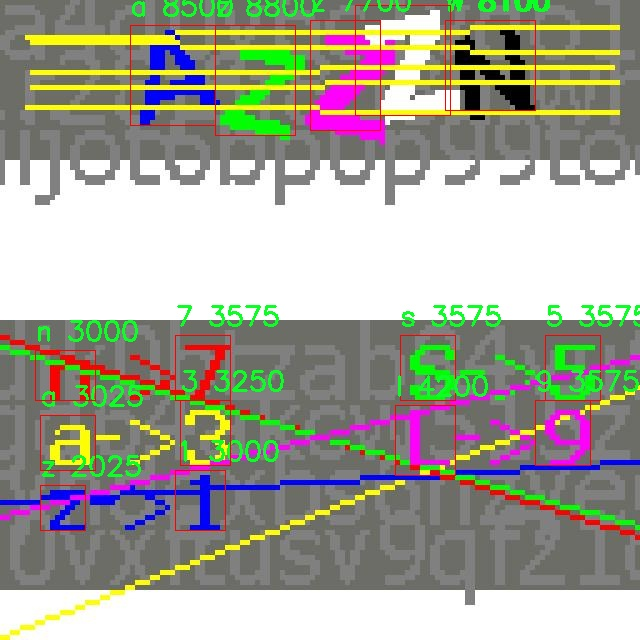

# 严重干扰的验证码识别检测系统源码分享
 # [一条龙教学YOLOV8标注好的数据集一键训练_70+全套改进创新点发刊_Web前端展示]

### 1.研究背景与意义

项目参考[AAAI Association for the Advancement of Artificial Intelligence](https://gitee.com/qunshansj/projects)

项目来源[AACV Association for the Advancement of Computer Vision](https://gitee.com/qunmasj/projects)

研究背景与意义

随着互联网的迅猛发展，验证码作为一种有效的安全机制，广泛应用于各种在线服务中，以防止自动化程序的恶意攻击和滥用。然而，传统的验证码设计往往面临着用户体验与安全性之间的矛盾。尤其是在面对严重干扰因素时，验证码的识别准确性和效率受到显著影响。因此，开发一种高效、准确的验证码识别系统显得尤为重要。

近年来，深度学习技术的快速发展为图像识别领域带来了革命性的变化。YOLO（You Only Look Once）系列模型因其高效的实时目标检测能力而受到广泛关注。YOLOv8作为该系列的最新版本，结合了更为先进的特征提取和处理机制，能够在复杂背景下实现高精度的目标检测。然而，针对验证码识别的特定需求，YOLOv8的标准模型在处理严重干扰时仍存在一定的局限性。因此，基于改进YOLOv8的验证码识别系统的研究具有重要的理论和实践意义。

本研究将利用包含1600张图像的验证码数据集，涵盖28个类别的字符和符号。这些类别包括数字（如1、3、5、7、9）和字母（如a、b、c、d、e、f、h、k、l、n、q、s、t、u、v、w、x、z），以及一些特殊字符（如dolar、and、thang、acong、per）。数据集的多样性为模型的训练提供了丰富的样本，能够有效提升模型的泛化能力和鲁棒性。通过对这些数据的深入分析和处理，我们可以更好地理解验证码在不同干扰条件下的特征表现，从而为模型的改进提供理论依据。

在实际应用中，验证码的设计常常采用多种干扰手段，如背景噪声、扭曲变形、颜色变化等，以增加自动识别的难度。这些干扰因素不仅影响了人类用户的识别能力，也对现有的深度学习模型提出了挑战。因此，针对这些干扰因素进行模型的改进，提升其在复杂环境下的识别能力，将是本研究的核心目标之一。

通过改进YOLOv8模型，我们将探索多种数据增强技术和特征提取方法，以提高模型在处理严重干扰验证码时的准确性和效率。同时，研究还将关注模型的实时性，确保其能够在实际应用中快速响应用户请求，提升用户体验。此外，本研究的成果不仅可以为验证码识别技术的发展提供新的思路，还可以为其他图像识别任务提供借鉴，推动相关领域的进步。

综上所述，基于改进YOLOv8的严重干扰验证码识别系统的研究，不仅具有重要的学术价值，还能为实际应用提供切实可行的解决方案。通过深入探讨验证码识别中的挑战与机遇，我们期望能够为网络安全领域贡献一份力量，推动验证码技术的进一步发展与完善。

### 2.图片演示


##### 注意：由于此博客编辑较早，上面“2.图片演示”和“3.视频演示”展示的系统图片或者视频可能为老版本，新版本在老版本的基础上升级如下：（实际效果以升级的新版本为准）

  （1）适配了YOLOV8的“目标检测”模型和“实例分割”模型，通过加载相应的权重（.pt）文件即可自适应加载模型。

  （2）支持“图片识别”、“视频识别”、“摄像头实时识别”三种识别模式。

  （3）支持“图片识别”、“视频识别”、“摄像头实时识别”三种识别结果保存导出，解决手动导出（容易卡顿出现爆内存）存在的问题，识别完自动保存结果并导出到tempDir中。

  （4）支持Web前端系统中的标题、背景图等自定义修改，后面提供修改教程。

  另外本项目提供训练的数据集和训练教程,暂不提供权重文件（best.pt）,需要您按照教程进行训练后实现图片演示和Web前端界面演示的效果。

### 3.视频演示

[3.1 视频演示](https://www.bilibili.com/video/BV1Er4neSELB/)

### 4.数据集信息展示

##### 4.1 本项目数据集详细数据（类别数＆类别名）

nc: 28
names: ['1', '3', '5', '7', '9', 'a', 'acong', 'and', 'b', 'c', 'd', 'dolar', 'e', 'f', 'h', 'k', 'l', 'n', 'per', 'q', 's', 't', 'thang', 'u', 'v', 'w', 'x', 'z']


##### 4.2 本项目数据集信息介绍

数据集信息展示

在现代计算机视觉领域，验证码识别作为一个重要的研究方向，面临着越来越多的挑战。为了有效地训练和改进YOLOv8模型，以应对严重干扰的验证码识别任务，我们构建了一个名为“capcha”的数据集。该数据集专门设计用于提升模型在复杂环境下的识别能力，包含了28个类别的字符，涵盖了数字和字母的多样性。这些类别包括：'1', '3', '5', '7', '9', 'a', 'acong', 'and', 'b', 'c', 'd', 'dolar', 'e', 'f', 'h', 'k', 'l', 'n', 'per', 'q', 's', 't', 'thang', 'u', 'v', 'w', 'x', 'z'。

“capcha”数据集的构建过程考虑到了验证码的多样性和复杂性。每个类别的字符不仅在形状上有所不同，还在颜色、背景、扭曲程度等方面进行了精心设计，以模拟真实世界中常见的验证码形式。这种多样性使得模型在训练过程中能够学习到更为丰富的特征，从而提升其在实际应用中的鲁棒性和准确性。

数据集中的每个字符样本都经过严格的标注，确保了高质量的训练数据。标注过程中，团队采用了多种图像处理技术，以增强样本的多样性和复杂性。这些技术包括图像旋转、缩放、噪声添加等，旨在模拟验证码在不同环境下的表现。此外，为了确保模型能够适应不同的验证码样式，数据集中还包含了多种字体和风格的字符图像，进一步丰富了训练数据的多样性。

在数据集的使用过程中，我们将其划分为训练集、验证集和测试集，以便于模型的训练和评估。训练集包含了大部分样本，用于模型的学习；验证集则用于在训练过程中监控模型的性能，调整超参数；测试集则用于最终评估模型的识别能力，确保其在未见数据上的表现。

通过对“capcha”数据集的深入分析和研究，我们期望能够有效提升YOLOv8在验证码识别任务中的性能。该数据集不仅为研究人员提供了一个可靠的基准，还为后续的验证码识别技术发展奠定了基础。随着深度学习技术的不断进步，我们相信“capcha”数据集将为验证码识别领域带来新的突破，推动相关研究的深入发展。

总之，“capcha”数据集的构建和应用，不仅为YOLOv8模型的训练提供了丰富的资源，也为验证码识别技术的进步提供了新的动力。我们期待通过不断的研究和探索，能够在验证码识别领域取得更大的成就，推动人工智能技术的广泛应用。




### 5.全套项目环境部署视频教程（零基础手把手教学）

[5.1 环境部署教程链接（零基础手把手教学）](https://www.ixigua.com/7404473917358506534?logTag=c807d0cbc21c0ef59de5)


[5.2 安装Python虚拟环境创建和依赖库安装视频教程链接（零基础手把手教学）](https://www.ixigua.com/7404474678003106304?logTag=1f1041108cd1f708b01a)

### 6.手把手YOLOV8训练视频教程（零基础小白有手就能学会）

[6.1 手把手YOLOV8训练视频教程（零基础小白有手就能学会）](https://www.ixigua.com/7404477157818401292?logTag=d31a2dfd1983c9668658)

### 7.70+种全套YOLOV8创新点代码加载调参视频教程（一键加载写好的改进模型的配置文件）

[7.1 70+种全套YOLOV8创新点代码加载调参视频教程（一键加载写好的改进模型的配置文件）](https://www.ixigua.com/7404478314661806627?logTag=29066f8288e3f4eea3a4)

### 8.70+种全套YOLOV8创新点原理讲解（非科班也可以轻松写刊发刊，V10版本正在科研待更新）

由于篇幅限制，每个创新点的具体原理讲解就不一一展开，具体见下列网址中的创新点对应子项目的技术原理博客网址【Blog】：


[8.1 70+种全套YOLOV8创新点原理讲解链接](https://gitee.com/qunmasj/good)

### 9.系统功能展示（检测对象为举例，实际内容以本项目数据集为准）

图9.1.系统支持检测结果表格显示

  图9.2.系统支持置信度和IOU阈值手动调节

  图9.3.系统支持自定义加载权重文件best.pt(需要你通过步骤5中训练获得)

  图9.4.系统支持摄像头实时识别

  图9.5.系统支持图片识别

  图9.6.系统支持视频识别

  图9.7.系统支持识别结果文件自动保存

  图9.8.系统支持Excel导出检测结果数据


### 10.原始YOLOV8算法原理

原始YOLOv8算法原理

YOLOv8作为YOLO系列的最新模型，标志着目标检测技术的一次重要进步。其设计理念在于将目标检测任务转化为一个回归问题，通过一个单一的神经网络模型同时预测目标的位置和类别。与之前的YOLO版本相比，YOLOv8在多个方面进行了创新和优化，尤其是在检测精度和速度上取得了显著提升。

YOLOv8的网络结构主要由三个部分组成：主干网络（Backbone）、特征增强网络（Neck）和检测头（Head）。在主干网络中，YOLOv8采用了CSP（Cross Stage Partial）结构，通过一系列卷积和反卷积层提取图像特征。这种结构不仅提高了特征提取的效率，还通过残差连接和瓶颈结构减小了网络的复杂度，从而提升了模型的性能。主干网络中使用的C2模块和快速空间金字塔池化（SPPF）模块，进一步增强了对多尺度特征的捕捉能力。

在特征增强网络方面，YOLOv8引入了PAN（Path Aggregation Network）结构，通过多尺度特征融合技术，将来自主干网络不同阶段的特征图进行有效融合。这一过程不仅提高了模型对不同尺度目标的检测能力，还增强了模型的鲁棒性，使其在复杂场景下的表现更加出色。特征增强网络的设计理念在于，通过对不同尺度特征的有效整合，帮助模型更好地理解图像中的目标信息。

YOLOv8的检测头部分则采用了解耦头（Decoupled Head）结构，将分类和回归任务分为两个独立的分支。这一创新使得每个任务能够更加专注于自身的目标，从而有效解决了复杂场景下定位不准及分类错误的问题。通过解耦，YOLOv8能够更精准地进行目标检测，尤其是在目标与背景复杂度较高的情况下。

值得注意的是，YOLOv8采用了Anchor-free的目标检测方法。这一方法的核心在于不再依赖于预先定义的锚点框，而是通过回归的方式直接预测目标的位置和大小。这一创新极大地简化了模型的设计，使得网络能够更快地聚焦于目标位置的邻近点，从而使得预测框更接近于实际边界框区域。这种Anchor-free的方法在处理不同尺度和形状的目标时，展现出了更高的灵活性和适应性。

尽管YOLOv8在多个方面表现出色，但在复杂水面环境下的应用仍然面临一些挑战。由于小目标漂浮物的特征复杂且背景多样，YOLOv8在这些情况下可能会出现定位误差和对目标感知能力不足的问题。为了解决这些问题，研究者们提出了YOLOv8-WSSOD算法，通过一系列改进来提升YOLOv8的性能。

首先，为了减轻主干网络下采样过程中的噪声影响，YOLOv8-WSSOD引入了捕获远程依赖的思想，采用了BiFormer双层路由注意力机制构建C2fBF模块。这一模块的设计旨在保留特征提取过程中更细粒度的上下文信息，从而提升模型对复杂场景的理解能力。

其次，针对小目标漏检的问题，YOLOv8-WSSOD在网络中添加了一个更小的检测头，以提升网络对小目标的感知力。此外，在Neck端引入GSConv和Slim-neck技术，旨在保持检测精度的同时降低计算量。这些改进措施使得YOLOv8-WSSOD在处理小目标时，能够更有效地捕捉到目标信息，从而减少漏检现象的发生。

最后，YOLOv8-WSSOD还使用了MPDIoU损失函数替换了CIoU损失函数，以提高模型的泛化能力和精准度。MPDIoU损失函数通过更精细的目标框匹配机制，进一步提升了模型在复杂环境下的表现。

综上所述，YOLOv8作为YOLO系列的重要进展，凭借其创新的网络结构和Anchor-free的检测方法，在目标检测领域展现出了强大的能力。尽管在特定复杂环境下仍存在一些挑战，但通过不断的改进和优化，YOLOv8及其衍生算法有望在未来的应用中实现更高的检测精度和速度，为目标检测技术的发展贡献力量。


### 11.项目核心源码讲解（再也不用担心看不懂代码逻辑）

#### 11.1 code\chinese_name_list.py

下面是对给定代码的核心部分进行分析和详细注释的结果：

```python
# -*- coding: utf-8 -*-  # 指定文件编码为UTF-8，以支持中文字符

# 创建一个字典，包含中文名称与其对应的英文标签
Chinese_name = {'person': "人"}

# 从字典中提取所有的中文名称，生成一个列表
Label_list = list(Chinese_name.values())

# 代码执行后，Label_list 将包含 ["人"]
```

### 代码分析：
1. **文件编码**：`# -*- coding: utf-8 -*-` 这一行用于指定文件的编码格式为UTF-8，确保可以正确处理中文字符。
  
2. **字典创建**：`Chinese_name = {'person': "人"}` 创建了一个字典，其中键是英文标签（`person`），值是对应的中文名称（`人`）。字典是一种键值对的数据结构，适合用于存储和查找相关联的数据。

3. **列表生成**：`Label_list = list(Chinese_name.values())` 通过调用字典的 `values()` 方法获取所有的值（即中文名称），并将其转换为列表。最终，`Label_list` 将包含字典中所有的中文名称，这里是 `["人"]`。

### 总结：
这段代码的核心功能是将英文标签与中文名称进行映射，并提取出所有的中文名称，存储在一个列表中，便于后续使用。

这个文件的名称是 `chinese_name_list.py`，它的主要功能是定义一个包含中文名称的字典，并从中提取出一个标签列表。

首先，文件开头的 `# -*- coding: utf-8 -*-` 是一个编码声明，表示这个文件使用 UTF-8 编码。这对于处理中文字符非常重要，因为 UTF-8 可以正确地表示各种语言的字符。

接下来，代码中定义了一个字典 `Chinese_name`，其中包含一个键值对。键是 `'person'`，对应的值是 `"人"`。这个字典的目的是将英文单词与其中文翻译进行关联。在这个例子中，`'person'` 这个英文单词被翻译成了中文的 `"人"`。

然后，代码通过 `list(Chinese_name.values())` 创建了一个列表 `Label_list`，这个列表包含了字典 `Chinese_name` 中所有的值。在这个例子中，`Label_list` 将会是一个包含单一元素的列表，即 `["人"]`。

总结来说，这段代码的主要作用是建立一个简单的中英文对应关系，并将中文部分提取到一个列表中，以便后续使用。这个结构可以方便地扩展，添加更多的中英文对照项。

#### 11.2 code\ultralytics\data\converter.py

以下是经过简化并添加详细中文注释的核心代码部分：

```python
import json
from collections import defaultdict
from pathlib import Path
import numpy as np
from ultralytics.utils import LOGGER, TQDM
from ultralytics.utils.files import increment_path

def coco91_to_coco80_class():
    """
    将91类COCO类别ID转换为80类COCO类别ID。
    
    返回:
        (list): 一个包含91个类别ID的列表，其中索引表示80类的类别ID，值为对应的91类ID。
    """
    return [
        0, 1, 2, 3, 4, 5, 6, 7, 8, 9, 10, None, 11, 12, 13, 14, 15, 16, 17, 18, 19, 20,
        21, 22, 23, None, 24, 25, None, None, 26, 27, 28, 29, 30, 31, 32, 33, 34, 35,
        36, 37, 38, 39, None, 40, 41, 42, 43, 44, 45, 46, 47, 48, 49, 50, 51, 52, 53,
        54, 55, 56, 57, 58, 59, None, 60, None, None, 61, None, 62, 63, 64, 65, 66, 67,
        68, 69, 70, 71, 72, None, 73, 74, 75, 76, 77, 78, 79, None,
    ]

def convert_coco(labels_dir="../coco/annotations/", save_dir="coco_converted/", cls91to80=True):
    """
    将COCO数据集的注释转换为YOLO注释格式，以便训练YOLO模型。

    参数:
        labels_dir (str): 包含COCO数据集注释文件的目录路径。
        save_dir (str): 保存结果的目录路径。
        cls91to80 (bool): 是否将91个COCO类别ID映射到对应的80个COCO类别ID。
    """
    # 创建保存目录
    save_dir = increment_path(save_dir)  # 如果保存目录已存在，则增加后缀
    for p in save_dir / "labels", save_dir / "images":
        p.mkdir(parents=True, exist_ok=True)  # 创建目录

    # 转换类别
    coco80 = coco91_to_coco80_class()

    # 导入json文件
    for json_file in sorted(Path(labels_dir).resolve().glob("*.json")):
        fn = Path(save_dir) / "labels" / json_file.stem.replace("instances_", "")  # 文件夹名称
        fn.mkdir(parents=True, exist_ok=True)
        with open(json_file) as f:
            data = json.load(f)

        # 创建图像字典
        images = {f'{x["id"]:d}': x for x in data["images"]}
        # 创建图像-注释字典
        imgToAnns = defaultdict(list)
        for ann in data["annotations"]:
            imgToAnns[ann["image_id"]].append(ann)

        # 写入标签文件
        for img_id, anns in TQDM(imgToAnns.items(), desc=f"Annotations {json_file}"):
            img = images[f"{img_id:d}"]
            h, w, f = img["height"], img["width"], img["file_name"]

            bboxes = []  # 存储边界框
            for ann in anns:
                if ann["iscrowd"]:
                    continue  # 跳过人群注释
                # COCO框格式为 [左上角x, 左上角y, 宽度, 高度]
                box = np.array(ann["bbox"], dtype=np.float64)
                box[:2] += box[2:] / 2  # 将左上角坐标转换为中心坐标
                box[[0, 2]] /= w  # 归一化x坐标
                box[[1, 3]] /= h  # 归一化y坐标
                if box[2] <= 0 or box[3] <= 0:  # 如果宽度或高度小于等于0
                    continue

                cls = coco80[ann["category_id"] - 1] if cls91to80 else ann["category_id"] - 1  # 类别
                box = [cls] + box.tolist()  # 添加类别到边界框
                if box not in bboxes:
                    bboxes.append(box)

            # 写入文件
            with open((fn / f).with_suffix(".txt"), "a") as file:
                for bbox in bboxes:
                    file.write(("%g " * len(bbox)).rstrip() % bbox + "\n")

    LOGGER.info(f"COCO数据成功转换。\n结果保存到 {save_dir.resolve()}")
```

### 代码说明：
1. **coco91_to_coco80_class**: 该函数将91类COCO类别ID转换为80类COCO类别ID，返回一个列表，其中索引表示80类的类别ID，值为对应的91类ID。

2. **convert_coco**: 该函数负责将COCO数据集的注释转换为YOLO格式。它会创建保存目录，读取COCO的JSON注释文件，并将每个图像的注释转换为YOLO所需的格式。具体步骤包括：
   - 创建保存目录。
   - 读取JSON文件并解析图像和注释。
   - 对每个图像的注释进行处理，计算边界框并归一化。
   - 将结果写入到指定的文本文件中。

3. **TQDM**: 用于显示进度条，帮助用户了解处理进度。

4. **LOGGER**: 用于记录日志信息，提示用户转换过程的状态。

这个程序文件主要用于将COCO数据集的标注格式转换为YOLO模型所需的标注格式。文件中包含多个函数，具体功能如下：

首先，`coco91_to_coco80_class`和`coco80_to_coco91_class`两个函数用于在COCO数据集中进行类别ID的转换。COCO数据集有91个类别，而YOLO模型通常使用80个类别，因此这两个函数提供了从91个类别到80个类别的映射，以及反向映射的功能。返回的列表中，索引表示80-index类别ID，而值则是对应的91-index类别ID。

接下来，`convert_coco`函数是该文件的核心功能。它负责将COCO数据集的标注文件转换为YOLO格式。函数接受多个参数，包括标注文件的目录、保存结果的目录、是否使用分割掩码、是否使用关键点标注，以及是否将91个类别ID映射到80个类别ID。函数首先创建保存结果的目录，并确保所需的子目录存在。然后，它读取指定目录下的所有JSON标注文件，并将其解析为Python字典。

在解析过程中，函数会创建一个图像字典和一个图像-标注字典。对于每张图像，函数提取其高度、宽度和文件名，并遍历与该图像相关的所有标注。标注的边界框（bbox）格式为[左上角x, 左上角y, 宽度, 高度]，函数将其转换为YOLO所需的格式，即[中心x, 中心y, 宽度, 高度]，并进行归一化处理。然后，函数根据需要将类别ID进行转换，并将边界框、分割和关键点信息写入到相应的文本文件中。

`convert_dota_to_yolo_obb`函数则是用于将DOTA数据集的标注转换为YOLO的有向边界框（OBB）格式。该函数会处理DOTA数据集中的训练和验证图像，并读取原始标签，将其转换后保存到新的目录中。函数内部定义了一个`convert_label`辅助函数，用于处理单个图像的标注转换。

此外，文件中还包含两个辅助函数：`min_index`用于查找两个二维点数组之间距离最短的点对索引，`merge_multi_segment`用于合并多个分割线段，将其连接成一个完整的线段。这些辅助函数在处理复杂的标注数据时提供了必要的支持。

最后，程序使用了`LOGGER`来记录转换成功的信息，并输出结果保存的目录。这些功能的组合使得该程序能够有效地将COCO和DOTA数据集的标注格式转换为YOLO模型所需的格式，便于后续的模型训练和评估。

#### 11.3 ui.py

以下是保留的核心代码部分，并添加了详细的中文注释：

```python
import sys
import subprocess

def run_script(script_path):
    """
    使用当前 Python 环境运行指定的脚本。

    Args:
        script_path (str): 要运行的脚本路径

    Returns:
        None
    """
    # 获取当前 Python 解释器的路径
    python_path = sys.executable

    # 构建运行命令，使用 streamlit 运行指定的脚本
    command = f'"{python_path}" -m streamlit run "{script_path}"'

    # 执行命令，并等待其完成
    result = subprocess.run(command, shell=True)
    
    # 检查命令执行的返回码，如果不为0则表示出错
    if result.returncode != 0:
        print("脚本运行出错。")

# 实例化并运行应用
if __name__ == "__main__":
    # 指定要运行的脚本路径
    script_path = "web.py"  # 这里可以直接指定脚本名

    # 调用函数运行脚本
    run_script(script_path)
```

### 代码说明：
1. **导入模块**：
   - `sys`：用于访问与 Python 解释器相关的变量和函数。
   - `subprocess`：用于创建新进程、连接到它们的输入/输出/错误管道，并获得返回码。

2. **定义 `run_script` 函数**：
   - 该函数接收一个脚本路径作为参数，并使用当前 Python 环境来运行该脚本。
   - 使用 `sys.executable` 获取当前 Python 解释器的路径。
   - 构建一个命令字符串，该命令使用 `streamlit` 模块来运行指定的脚本。
   - 使用 `subprocess.run` 执行构建的命令，并检查返回码以确定脚本是否成功运行。

3. **主程序块**：
   - 当脚本作为主程序运行时，指定要运行的脚本路径（在这里是 `web.py`）。
   - 调用 `run_script` 函数来执行指定的脚本。

这个程序文件的主要功能是使用当前的 Python 环境来运行一个指定的脚本，具体是一个名为 `web.py` 的文件。程序首先导入了必要的模块，包括 `sys`、`os` 和 `subprocess`，以及一个自定义的 `abs_path` 函数，用于获取脚本的绝对路径。

在 `run_script` 函数中，首先获取当前 Python 解释器的路径，这样可以确保在正确的环境中运行脚本。接着，构建一个命令字符串，该命令使用 `streamlit` 模块来运行指定的脚本。`streamlit` 是一个用于构建数据应用的流行库，命令格式为 `python -m streamlit run "script_path"`。

随后，使用 `subprocess.run` 方法执行构建好的命令。如果脚本运行返回的状态码不为零，表示运行过程中出现了错误，程序会打印出“脚本运行出错”的提示。

在文件的最后部分，使用 `if __name__ == "__main__":` 语句来确保只有在直接运行该文件时才会执行后面的代码。在这里，指定了要运行的脚本路径为 `web.py`，并调用 `run_script` 函数来执行该脚本。

总的来说，这个程序的作用是提供一个简单的接口来运行 `web.py` 脚本，确保在当前 Python 环境中执行，并处理可能出现的错误。

#### 11.4 70+种YOLOv8算法改进源码大全和调试加载训练教程（非必要）\ultralytics\models\yolo\pose\predict.py

以下是经过简化和注释的核心代码部分：

```python
# 导入必要的模块和类
from ultralytics.engine.results import Results
from ultralytics.models.yolo.detect.predict import DetectionPredictor
from ultralytics.utils import DEFAULT_CFG, LOGGER, ops

class PosePredictor(DetectionPredictor):
    """
    PosePredictor类，继承自DetectionPredictor，用于基于姿态模型的预测。
    """

    def __init__(self, cfg=DEFAULT_CFG, overrides=None, _callbacks=None):
        """初始化PosePredictor，设置任务为'pose'并记录使用'mps'作为设备的警告。"""
        super().__init__(cfg, overrides, _callbacks)  # 调用父类构造函数
        self.args.task = 'pose'  # 设置任务类型为姿态预测
        # 检查设备类型，如果是'mps'，则发出警告
        if isinstance(self.args.device, str) and self.args.device.lower() == 'mps':
            LOGGER.warning("WARNING ⚠️ Apple MPS known Pose bug. Recommend 'device=cpu' for Pose models. "
                           'See https://github.com/ultralytics/ultralytics/issues/4031.')

    def postprocess(self, preds, img, orig_imgs):
        """对给定输入图像或图像列表返回检测结果。"""
        # 应用非极大值抑制，过滤预测结果
        preds = ops.non_max_suppression(preds,
                                        self.args.conf,  # 置信度阈值
                                        self.args.iou,   # IOU阈值
                                        agnostic=self.args.agnostic_nms,  # 是否类别无关
                                        max_det=self.args.max_det,  # 最大检测数量
                                        classes=self.args.classes,  # 选择的类别
                                        nc=len(self.model.names))  # 类别数量

        # 如果输入图像不是列表，则将其转换为numpy数组
        if not isinstance(orig_imgs, list):
            orig_imgs = ops.convert_torch2numpy_batch(orig_imgs)

        results = []  # 存储结果的列表
        for i, pred in enumerate(preds):  # 遍历每个预测结果
            orig_img = orig_imgs[i]  # 获取原始图像
            # 将预测框的坐标缩放到原始图像的尺寸
            pred[:, :4] = ops.scale_boxes(img.shape[2:], pred[:, :4], orig_img.shape).round()
            # 获取关键点预测并进行缩放
            pred_kpts = pred[:, 6:].view(len(pred), *self.model.kpt_shape) if len(pred) else pred[:, 6:]
            pred_kpts = ops.scale_coords(img.shape[2:], pred_kpts, orig_img.shape)
            img_path = self.batch[0][i]  # 获取图像路径
            # 将结果添加到结果列表中
            results.append(
                Results(orig_img, path=img_path, names=self.model.names, boxes=pred[:, :6], keypoints=pred_kpts))
        return results  # 返回所有结果
```

### 代码说明：
1. **导入模块**：导入必要的类和函数，以便在PosePredictor类中使用。
2. **PosePredictor类**：继承自DetectionPredictor，专门用于姿态预测。
3. **构造函数**：初始化时设置任务类型为“pose”，并检查设备类型以避免在Apple MPS上运行时出现已知问题。
4. **后处理函数**：对模型的预测结果进行后处理，包括非极大值抑制、坐标缩放等操作，最终返回处理后的结果。

这个程序文件是Ultralytics YOLO框架中的一个模块，专门用于姿态预测（Pose Prediction）。它扩展了DetectionPredictor类，主要功能是对输入图像进行姿态估计，并返回检测结果。

在文件开头，首先导入了一些必要的模块和类，包括Results类、DetectionPredictor类以及一些工具函数。接着定义了PosePredictor类，该类继承自DetectionPredictor，意味着它可以使用DetectionPredictor中定义的功能，同时增加了姿态预测的特定功能。

PosePredictor类的构造函数`__init__`中，首先调用了父类的构造函数来初始化基本设置。然后，它将任务类型设置为'pose'，表示该模型的主要任务是进行姿态预测。此外，如果设备类型是'MPS'（Apple的Metal Performance Shaders），则会发出警告，提示用户在使用姿态模型时推荐使用'cpu'，因为在MPS上存在已知的bug。

`postprocess`方法是PosePredictor类的核心功能之一。它接收预测结果、输入图像和原始图像列表，并对预测结果进行后处理。首先，它调用非极大值抑制（NMS）函数来过滤掉低置信度的检测结果，确保只保留最有可能的检测。接着，检查输入图像是否为列表，如果不是，则将其转换为NumPy数组。

随后，程序遍历每个预测结果，并对每个结果进行坐标缩放，以适应原始图像的尺寸。它还处理关键点的预测结果，确保这些关键点的坐标也经过相应的缩放。最后，将每个原始图像的路径、检测框和关键点信息封装成Results对象，并将其添加到结果列表中。

总的来说，这个文件实现了一个用于姿态预测的类，能够处理输入图像并返回经过后处理的检测结果，适用于YOLOv8模型的姿态估计任务。

#### 11.5 train.py

以下是经过简化和注释的核心代码部分：

```python
import random
import numpy as np
import torch.nn as nn
from ultralytics.data import build_dataloader, build_yolo_dataset
from ultralytics.engine.trainer import BaseTrainer
from ultralytics.models import yolo
from ultralytics.nn.tasks import DetectionModel
from ultralytics.utils import LOGGER, RANK
from ultralytics.utils.torch_utils import de_parallel, torch_distributed_zero_first

class DetectionTrainer(BaseTrainer):
    """
    基于检测模型的训练类，继承自BaseTrainer类。
    """

    def build_dataset(self, img_path, mode="train", batch=None):
        """
        构建YOLO数据集。

        参数:
            img_path (str): 图像文件夹的路径。
            mode (str): 模式，`train`或`val`，可以为每种模式自定义不同的数据增强。
            batch (int, optional): 批次大小，适用于`rect`模式。默认为None。
        """
        gs = max(int(de_parallel(self.model).stride.max() if self.model else 0), 32)
        return build_yolo_dataset(self.args, img_path, batch, self.data, mode=mode, rect=mode == "val", stride=gs)

    def get_dataloader(self, dataset_path, batch_size=16, rank=0, mode="train"):
        """构造并返回数据加载器。"""
        assert mode in ["train", "val"]
        with torch_distributed_zero_first(rank):  # DDP模式下只初始化一次数据集
            dataset = self.build_dataset(dataset_path, mode, batch_size)
        shuffle = mode == "train"  # 训练模式下打乱数据
        workers = self.args.workers if mode == "train" else self.args.workers * 2
        return build_dataloader(dataset, batch_size, workers, shuffle, rank)  # 返回数据加载器

    def preprocess_batch(self, batch):
        """对图像批次进行预处理，包括缩放和转换为浮点数。"""
        batch["img"] = batch["img"].to(self.device, non_blocking=True).float() / 255  # 归一化图像
        if self.args.multi_scale:  # 如果启用多尺度
            imgs = batch["img"]
            sz = (
                random.randrange(self.args.imgsz * 0.5, self.args.imgsz * 1.5 + self.stride)
                // self.stride
                * self.stride
            )  # 随机选择新的尺寸
            sf = sz / max(imgs.shape[2:])  # 计算缩放因子
            if sf != 1:
                ns = [
                    math.ceil(x * sf / self.stride) * self.stride for x in imgs.shape[2:]
                ]  # 计算新的形状
                imgs = nn.functional.interpolate(imgs, size=ns, mode="bilinear", align_corners=False)  # 调整图像大小
            batch["img"] = imgs
        return batch

    def get_model(self, cfg=None, weights=None, verbose=True):
        """返回YOLO检测模型。"""
        model = DetectionModel(cfg, nc=self.data["nc"], verbose=verbose and RANK == -1)
        if weights:
            model.load(weights)  # 加载模型权重
        return model

    def plot_training_samples(self, batch, ni):
        """绘制带有注释的训练样本。"""
        plot_images(
            images=batch["img"],
            batch_idx=batch["batch_idx"],
            cls=batch["cls"].squeeze(-1),
            bboxes=batch["bboxes"],
            paths=batch["im_file"],
            fname=self.save_dir / f"train_batch{ni}.jpg",
            on_plot=self.on_plot,
        )

    def plot_metrics(self):
        """从CSV文件中绘制指标。"""
        plot_results(file=self.csv, on_plot=self.on_plot)  # 保存结果图
```

### 代码注释说明：
1. **导入模块**：导入必要的库和模块，包括数据处理、模型训练和绘图工具。
2. **DetectionTrainer类**：这是一个用于训练YOLO检测模型的类，继承自基础训练类`BaseTrainer`。
3. **build_dataset方法**：构建YOLO数据集，支持训练和验证模式。
4. **get_dataloader方法**：构造数据加载器，处理数据集的加载和批次的设置。
5. **preprocess_batch方法**：对输入的图像批次进行预处理，包括归一化和可能的缩放。
6. **get_model方法**：返回一个YOLO检测模型，并可选择加载预训练权重。
7. **plot_training_samples方法**：绘制训练样本及其对应的标注信息。
8. **plot_metrics方法**：从CSV文件中绘制训练过程中的指标，便于可视化分析。

这个程序文件 `train.py` 是一个用于训练目标检测模型的脚本，特别是基于 YOLO（You Only Look Once）架构的模型。文件中包含了一个名为 `DetectionTrainer` 的类，该类继承自 `BaseTrainer`，并实现了一系列用于训练的功能。

在文件的开头，导入了一些必要的库和模块，包括数学运算、随机数生成、深度学习相关的库（如 PyTorch）以及一些来自 `ultralytics` 库的工具函数和类。这些导入为后续的训练过程提供了基础。

`DetectionTrainer` 类的主要功能是构建数据集、获取数据加载器、预处理图像批次、设置模型属性、获取模型、进行模型验证、记录损失、显示训练进度、绘制训练样本和绘制训练指标等。类中的每个方法都承担着特定的任务，确保训练过程的顺利进行。

`build_dataset` 方法用于构建 YOLO 数据集。它接收图像路径、模式（训练或验证）和批次大小作为参数，并根据模型的步幅计算合适的图像大小。`get_dataloader` 方法则构建并返回数据加载器，确保在分布式训练时只初始化一次数据集，并根据模式设置是否打乱数据。

`preprocess_batch` 方法负责对图像批次进行预处理，包括将图像缩放到适当的大小并转换为浮点数格式。`set_model_attributes` 方法用于设置模型的属性，如类别数量和类别名称，以便模型能够正确处理输入数据。

`get_model` 方法返回一个 YOLO 检测模型，可以选择加载预训练权重。`get_validator` 方法返回一个用于验证模型性能的验证器，记录损失名称以便后续分析。

`label_loss_items` 方法用于返回带有标签的训练损失项字典，以便于监控训练过程中的损失变化。`progress_string` 方法生成一个格式化的字符串，显示训练进度，包括当前的 epoch、GPU 内存使用情况、损失值、实例数量和图像大小。

`plot_training_samples` 方法用于绘制训练样本及其注释，便于可视化训练过程中的数据。最后，`plot_metrics` 和 `plot_training_labels` 方法分别用于绘制训练指标和创建带标签的训练图，以便于分析模型的性能和训练效果。

总体而言，这个程序文件为 YOLO 模型的训练提供了全面的支持，涵盖了数据处理、模型训练、验证和结果可视化等多个方面。

#### 11.6 70+种YOLOv8算法改进源码大全和调试加载训练教程（非必要）\ultralytics\data\converter.py

以下是代码中最核心的部分，并附上详细的中文注释：

```python
def coco91_to_coco80_class():
    """
    将91个COCO类ID转换为80个COCO类ID。

    返回:
        (list): 一个包含91个类ID的列表，其中索引表示80个类ID，值为对应的91个类ID。
    """
    return [
        0, 1, 2, 3, 4, 5, 6, 7, 8, 9, 10, None, 11, 12, 13, 14, 15, 16, 17, 18, 19, 20, 21, 22, 23, None, 24, 25, None,
        None, 26, 27, 28, 29, 30, 31, 32, 33, 34, 35, 36, 37, 38, 39, None, 40, 41, 42, 43, 44, 45, 46, 47, 48, 49, 50,
        51, 52, 53, 54, 55, 56, 57, 58, 59, None, 60, None, None, 61, None, 62, 63, 64, 65, 66, 67, 68, 69, 70, 71, 72,
        None, 73, 74, 75, 76, 77, 78, 79, None]

def convert_coco(labels_dir='../coco/annotations/',
                 save_dir='coco_converted/',
                 use_segments=False,
                 use_keypoints=False,
                 cls91to80=True):
    """
    将COCO数据集的注释转换为适合训练YOLO模型的YOLO注释格式。

    参数:
        labels_dir (str, optional): 包含COCO数据集注释文件的目录路径。
        save_dir (str, optional): 保存结果的目录路径。
        use_segments (bool, optional): 是否在输出中包含分割掩码。
        use_keypoints (bool, optional): 是否在输出中包含关键点注释。
        cls91to80 (bool, optional): 是否将91个COCO类ID映射到对应的80个COCO类ID。

    输出:
        在指定的输出目录中生成输出文件。
    """

    # 创建数据集目录
    save_dir = increment_path(save_dir)  # 如果保存目录已存在，则递增
    for p in save_dir / 'labels', save_dir / 'images':
        p.mkdir(parents=True, exist_ok=True)  # 创建目录

    # 转换类
    coco80 = coco91_to_coco80_class()

    # 导入json
    for json_file in sorted(Path(labels_dir).resolve().glob('*.json')):
        fn = Path(save_dir) / 'labels' / json_file.stem.replace('instances_', '')  # 文件夹名称
        fn.mkdir(parents=True, exist_ok=True)
        with open(json_file) as f:
            data = json.load(f)

        # 创建图像字典
        images = {f'{x["id"]:d}': x for x in data['images']}
        # 创建图像-注释字典
        imgToAnns = defaultdict(list)
        for ann in data['annotations']:
            imgToAnns[ann['image_id']].append(ann)

        # 写入标签文件
        for img_id, anns in TQDM(imgToAnns.items(), desc=f'Annotations {json_file}'):
            img = images[f'{img_id:d}']
            h, w, f = img['height'], img['width'], img['file_name']

            bboxes = []  # 存储边界框
            segments = []  # 存储分割
            keypoints = []  # 存储关键点
            for ann in anns:
                if ann['iscrowd']:
                    continue  # 跳过人群注释
                # COCO框格式为[左上角x, 左上角y, 宽度, 高度]
                box = np.array(ann['bbox'], dtype=np.float64)
                box[:2] += box[2:] / 2  # 将左上角坐标转换为中心坐标
                box[[0, 2]] /= w  # 归一化x坐标
                box[[1, 3]] /= h  # 归一化y坐标
                if box[2] <= 0 or box[3] <= 0:  # 如果宽度或高度小于等于0
                    continue

                cls = coco80[ann['category_id'] - 1] if cls91to80 else ann['category_id'] - 1  # 类别
                box = [cls] + box.tolist()  # 将类别和边界框合并
                if box not in bboxes:
                    bboxes.append(box)  # 添加边界框
                if use_segments and ann.get('segmentation') is not None:
                    # 处理分割信息
                    if len(ann['segmentation']) == 0:
                        segments.append([])
                        continue
                    elif len(ann['segmentation']) > 1:
                        s = merge_multi_segment(ann['segmentation'])
                        s = (np.concatenate(s, axis=0) / np.array([w, h])).reshape(-1).tolist()
                    else:
                        s = [j for i in ann['segmentation'] for j in i]  # 所有分割连接
                        s = (np.array(s).reshape(-1, 2) / np.array([w, h])).reshape(-1).tolist()
                    s = [cls] + s
                    if s not in segments:
                        segments.append(s)  # 添加分割
                if use_keypoints and ann.get('keypoints') is not None:
                    keypoints.append(box + (np.array(ann['keypoints']).reshape(-1, 3) /
                                            np.array([w, h, 1])).reshape(-1).tolist())

            # 写入文件
            with open((fn / f).with_suffix('.txt'), 'a') as file:
                for i in range(len(bboxes)):
                    if use_keypoints:
                        line = *(keypoints[i]),  # 类别, 边界框, 关键点
                    else:
                        line = *(segments[i]
                                 if use_segments and len(segments[i]) > 0 else bboxes[i]),  # 类别, 边界框或分割
                    file.write(('%g ' * len(line)).rstrip() % line + '\n')

    LOGGER.info(f'COCO数据成功转换。\n结果保存到 {save_dir.resolve()}')
```

### 代码说明
1. **coco91_to_coco80_class**: 该函数将91个COCO类ID映射到80个COCO类ID，返回一个列表，列表的索引表示80个类ID，值为对应的91个类ID。

2. **convert_coco**: 该函数将COCO数据集的注释转换为YOLO格式。它接收多个参数，包括注释文件的目录、保存结果的目录、是否使用分割和关键点信息等。函数内部创建保存目录，读取COCO格式的JSON文件，解析图像和注释信息，并将其转换为YOLO格式，最后保存到指定目录。

3. **边界框处理**: 在处理每个注释时，首先将COCO格式的边界框转换为YOLO格式（中心坐标和宽高），并进行归一化处理。根据需要将类别ID进行转换，并将结果存储在相应的列表中。

4. **写入文件**: 最后，将转换后的边界框、分割和关键点信息写入到文本文件中，以便YOLO模型进行训练。

这个程序文件是一个用于将COCO数据集和DOTA数据集的标注转换为YOLO格式的工具，主要用于深度学习中的目标检测任务。程序中包含多个函数，每个函数的功能如下：

首先，`coco91_to_coco80_class`和`coco80_to_coco91_class`两个函数用于在COCO数据集中转换类别ID。COCO数据集原本有91个类别，但YOLO使用的是80个类别，因此这两个函数提供了从91类到80类以及反向转换的映射关系。

接下来，`convert_coco`函数是该文件的核心功能之一，它将COCO数据集的标注文件转换为YOLO格式。函数接受多个参数，包括标注文件的目录、保存结果的目录、是否使用分割掩码和关键点标注等。该函数首先创建保存结果的目录，然后读取指定目录下的所有JSON格式的标注文件。它将每个图像的标注信息提取出来，计算归一化的边界框，并根据需要将分割和关键点信息添加到输出中。最终，转换后的标注信息会被写入到YOLO格式的文本文件中。

`convert_dota_to_yolo_obb`函数则是专门用于将DOTA数据集的标注转换为YOLO的OBB（有向边界框）格式。该函数会遍历DOTA数据集中的训练和验证图像，读取原始标注并将其转换为YOLO格式，保存到指定的目录中。函数内部定义了一个`convert_label`的辅助函数，用于处理单个图像的标注转换。

此外，`min_index`函数用于查找两个二维点数组之间距离最短的点对的索引，常用于处理分割时的点连接问题。`merge_multi_segment`函数则用于将多个分割线段合并为一个，确保连接的线段之间的距离最小，以形成一个连续的分割。

整体来看，这个程序文件为目标检测任务提供了强大的数据预处理功能，能够将不同格式的标注数据转换为YOLO所需的格式，方便后续的模型训练和评估。

### 12.系统整体结构（节选）

### 整体功能和构架概括

该项目的整体功能是实现基于YOLO（You Only Look Once）架构的目标检测和姿态估计模型的训练、预测和数据处理。项目中包含多个模块和文件，涵盖了从数据集转换、模型训练、姿态预测到结果可视化等多个方面。主要功能包括：

1. **数据集转换**：将不同格式的标注数据（如COCO和DOTA）转换为YOLO所需的格式，以便于模型训练。
2. **模型训练**：提供训练YOLO模型的功能，包括数据加载、损失计算、模型验证和训练过程的可视化。
3. **姿态预测**：实现对输入图像进行姿态估计的功能，返回关键点和边界框信息。
4. **用户界面**：提供一个简单的用户界面来运行和管理模型训练和预测过程。

以下是每个文件的功能整理：

| 文件路径                                                                                          | 功能描述                                                       |
|---------------------------------------------------------------------------------------------------|--------------------------------------------------------------|
| `code\chinese_name_list.py`                                                                       | 定义中文名称字典并提取标签列表。                             |
| `code\ultralytics\data\converter.py`                                                              | 将COCO和DOTA数据集的标注转换为YOLO格式。                     |
| `ui.py`                                                                                           | 提供一个接口来运行指定的`web.py`脚本。                       |
| `70+种YOLOv8算法改进源码大全和调试加载训练教程（非必要）\ultralytics\models\yolo\pose\predict.py` | 实现姿态预测功能，处理输入图像并返回检测结果。               |
| `train.py`                                                                                        | 实现YOLO模型的训练，包括数据处理、模型训练和结果可视化。     |
| `code\ultralytics\utils\patches.py`                                                              | 提供对YOLO模型的补丁和增强功能。                             |
| `code\ultralytics\models\__init__.py`                                                            | 初始化YOLO模型相关的模块和类。                               |
| `70+种YOLOv8算法改进源码大全和调试加载训练教程（非必要）\ultralytics\utils\callbacks\raytune.py` | 提供与Ray Tune集成的回调函数，用于超参数调优。                |
| `code\ultralytics\utils\__init__.py`                                                             | 初始化YOLO模型的工具函数模块。                               |
| `70+种YOLOv8算法改进源码大全和调试加载训练教程（非必要）\ultralytics\utils\checks.py`          | 提供检查和验证功能，确保模型和数据的有效性。                 |
| `70+种YOLOv8算法改进源码大全和调试加载训练教程（非必要）\ultralytics\trackers\byte_tracker.py` | 实现字节跟踪器功能，用于目标跟踪任务。                       |

这个表格总结了项目中各个文件的主要功能，帮助理解项目的整体架构和各个模块之间的关系。

注意：由于此博客编辑较早，上面“11.项目核心源码讲解（再也不用担心看不懂代码逻辑）”中部分代码可能会优化升级，仅供参考学习，完整“训练源码”、“Web前端界面”和“70+种创新点源码”以“13.完整训练+Web前端界面+70+种创新点源码、数据集获取”的内容为准。

### 13.完整训练+Web前端界面+70+种创新点源码、数据集获取


# [下载链接：https://mbd.pub/o/bread/ZpuUlphq](https://mbd.pub/o/bread/ZpuUlphq)